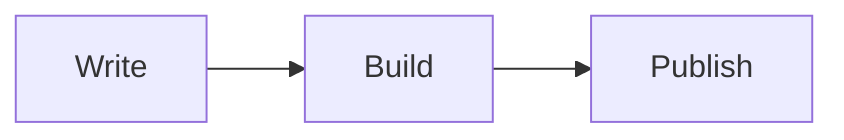
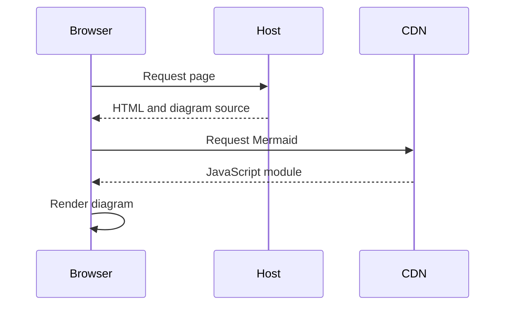
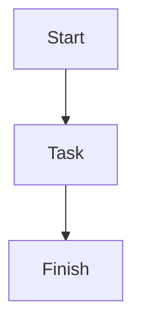

Mermaid support is available in the development version after v2.1.0.
Set `mermaid: true` in page front matter and write a fenced `mermaid` block.
See the [configuration and browser requirements](../docs/04-layouts#mermaid-diagrams).

```yaml
---
title: Mermaid diagrams
subtitle: Flowcharts and sequence diagrams from Markdown
header_type: base
mermaid: true
show_toc: true
categories: [demo]
tags: [mermaid, diagrams, markdown]
---
```

## Flowchart

Content passes through writing, building and publishing, in that order.



## Sequence diagram

The browser requests a page from the static host, then requests Mermaid from
the CDN to render its diagrams locally.



## Write your own

Copy this complete page example. The outer Markdown block remains ordinary
code and has a copy button; rendered diagrams do not have copy buttons.

````markdown
---
layout: default
title: My diagram
mermaid: true
---


````

If Mermaid cannot load or the diagram syntax is invalid, the source stays
visible. Add a prose explanation and `accTitle` and `accDescr` for accessible
diagrams.
