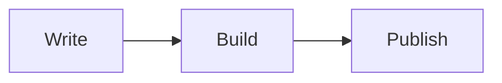

[Get the complete example](https://github.com/dieghernan/chulapa/tree/main/examples/technical-blog)
or follow the [start guide](../docs/00-start).
Copy the example's files into your own repository and replace the sample content.
The complete example includes a Gemfile and configuration; this demo displays
its home-page source.

## Home-page header

```yaml
---
layout: indexcategory
title: Engineering notes
subtitle: Code examples, diagrams and practical tutorials
header_type: base
include_collection: posts
index_sort: date
index_items: 12
---
```

## Home-page content

Notes with code, diagrams and mathematical notation.

## Sample article


Describe a workflow with a diagram, an equation and a code example.

## Workflow

The process starts with writing and ends with publishing.



## Code

```js
const steps = ["Write", "Build", "Publish"];
console.log(steps.join(" -> "));
```

## Equation

$$a^2 + b^2 = c^2$$

## Site configuration

```yaml
# Edit title, description, repository, url and baseurl before publishing.
remote_theme: dieghernan/chulapa
# The default branch includes development features. Append @TAG to pin a release.
title: Engineering notes
description: Code examples, diagrams and practical tutorials
repository: username/site
url: https://username.github.io
baseurl: /site
locale: en-US
plugins:
  - jekyll-remote-theme
  - jekyll-include-cache
  - jekyll-github-metadata
  - jekyll-paginate
  - jekyll-sitemap
exclude: [Gemfile, Gemfile.lock, README.md, vendor]
kramdown:
  input: GFM
chulapa-skin:
  skin: gitdev
navbar:
  brand:
    title: Engineering notes
  nav:
    - title: Home
      url: /
defaults:
  - scope:
      path: ""
      type: posts
    values:
      layout: default
      header_type: post
      include_on_feed: true
      show_date: true
```
