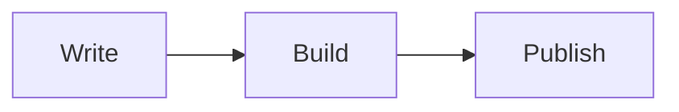

After configuring your site and choosing its appearance, create content using
the layouts and reusable snippets described below.

This guide assumes familiarity with [Markdown](https://markdown-it.github.io/)
and [Jekyll](https://jekyllrb.com/docs/). It focuses on the layouts and snippets
included in <span class="chulapa">Chulapa</span>.

See the [demos](https://dieghernan.github.io/chulapa/demo) for rendered examples.

## A. Layouts

### General purpose

#### Default

Use the `default` layout for posts, standalone pages and collection documents.
Enable its optional components through page front matter or defaults. To use
this layout:

```yaml

# On a specific page

---
layout: default
---

```

You can avoid typing this on each page by setting this layout as the default layout for all the pages via `_config.yml` and [front matter defaults](https://jekyllrb.com/docs/configuration/front-matter-defaults/):

```yaml

defaults:
  -
    scope:
      path: ""
    values:
      layout: "default"

```

##### Options

Additional options you can set on the front matter or via defaults:

- `title`, `subtitle`: Visible heading and subtitle for supported header types;
  also used when generating metadata.
- `date`, `last_modified_at`: Date of the page and last modification date. See [here](https://jekyllrb.com/docs/variables/#page-variables) to learn the accepted format of dates.
- `excerpt`: Brief description of the content. If not provided <span class="chulapa">Chulapa</span> would create it as the first paragraph of the content. Note that in the case of documents under `posts` Jekyll allows [additional options](https://jekyllrb.com/docs/posts/#post-excerpts).
- `description`: Explicit metadata description, independent of the visible subtitle and excerpt. See [SEO metadata](#seo-metadata) for precedence.
- `mathjax`: Set to `true` to load MathJax for mathematical notation.
- `mermaid`: Set to `true` to render Mermaid diagrams. Disabled by default; see
  [Mermaid diagrams](#mermaid-diagrams).
- `og_image`: Open Graph image displayed on the web and social networks when
  sharing the page. This image would not be displayed on the page.
- `schema_image`: A representative image URL or list of image URLs for a post's
  `BlogPosting` JSON-LD. It overrides the article image without changing Open
  Graph, Twitter cards or the visible header. See [Article
  images](#article-images).
- `robots`: Search crawler directives for the page, post or collection document.
  The default is `index, follow`; missing, empty or whitespace-only values use
  this default. For example, set this in a page's front matter:

```yaml
---
title: My page
robots: "noindex, follow"
---
```

You can also set `robots` through front matter defaults in `_config.yml`:

```yaml
defaults:
  - scope:
      path: "private-pages"
    values:
      robots: "noindex, follow"
```

An explicit page value overrides these defaults. Crawlers must be able to access the page to read its robots metadata; blocking the page in `robots.txt` prevents them from reading `noindex`. This option controls only the HTML metadata and does not change HTTP status codes, `robots.txt` or sitemap entries. The theme does not automatically apply `noindex` to error pages, search pages, tags, archives or pagination. See [Google's robots metadata documentation](https://developers.google.com/search/docs/crawling-indexing/robots-meta-tag).

- `header_type`: Choose `base`, `post`, `hero`, `image` or `splash`. Leave it
  unset or use an unrecognized value for no header.
- `header_img`: Image to be displayed on the header. If `og_image` is not set,
  this would be also the image to be displayed when sharing the page.

**Image previews** depend on each social platform's requirements. Use an
accessible image URL and check the resulting preview. You can use a
high-resolution image for `header_img` and a smaller sharing image for
`og_image`.
{: .alert .alert-info .p-3 .mx-2}

- `project_links`: Add header navigation links styled as buttons, for example
  links to a project's source code or documentation. Each entry accepts `url`,
  `icon` and `label`. Example:

```yaml
---
title: External project
project_links:
    - url: https://github.com/XXX # url1
      icon: fab fa-github         # Font Awesome icon code1
      label: View on GitHub       # Label on button 1
    - url: https://colab.research.google.com/XXX #url2
      icon: fab fa-python   # Font Awesome icon code2
      label: Open in Colab  # Label on button 2
---
```
- `show_date`: This would display the date of the page and the last modified
  date, if provided.
- `show_sociallinks`: Display sharing links for Facebook, Twitter/X, WhatsApp
  and LinkedIn.
- `show_author`: Set it to `true` to display the author of the page. By default it would display the `author` set on your [global settings](https://dieghernan.github.io/chulapa/docs/02-config), but you can override it via the page front matter:

```yaml
---
title: "Plain post 2"
subtitle: "Example 2"
author:
  name: Another name
  location: Santiago de Compostela
  avatar: https://github.com/devdieghernan.png
  links:
    - url: https://twitter.com/jack2
      icon: "fab fa-twitter"
      label: "Twitter"
---
```

- `show_toc`: Would display a table of contents of the page (thanks to [@allejo](https://github.com/allejo/jekyll-toc)).

- `show_sidetoc`: Alternative implementation of `show_toc` where the table of
  contents is displayed in a sliding off-canvas sidebar. This adds a
  button <button class="btn btn-primary btn-sm rounded-right bs-canvas-anim
  chulapa-btn-nofocus chulapa-fa-static" aria-label="Example button"
  style="opacity:0.4;border-top-left-radius: 0;
  border-bottom-left-radius: 0;">
		<i class="fa-solid fa-plus"></i><span class="sr-only">Example button</span>
	</button> on the left side of your page, click it to expand the sidebar table of contents. See the implementation on the [Current skin](https://dieghernan.github.io/chulapa/skins/current).

**Table of contents requires heading IDs.** Only headings with an `id` are displayed. If you are
including headers via markdown (`### Title`) you don't have to worry, as
**kramdown** would do it for you. However if you are using `html` (`<h1
id="aa">My heading</h1>`) don't forget to include the `id`.
{: .alert .alert-info .p-3 .mx-2}

- `h_min` and `h_max`: Minimum and maximum heading level to be included in the
  table of contents. **min: 2, max: 4**.

- `show_related`: Display up to three related collection documents, excluding
  the current page. Candidates must share at least two tags if they are in the
  same collection or at least three tags otherwise. More matches rank first,
  with newer dates used within each score.

- `show_random`: Display up to three randomly selected documents from the same
  candidate pool as `show_related`. Selection happens at build time, so the
  cards do not change on every page load.

**Related and random cards require tags.** Both components use collection
documents and the tag-based candidate pool; they do not select arbitrary pages.
{: .alert .alert-info .p-3 .mx-2 .mb-3}

- `related_label` and `random_label`: Text or HTML displayed before the related
  and random cards, respectively.

- `show_bottomnavs`: Display previous and next navigation at the bottom of the
  page when Jekyll supplies `page.previous` and `page.next`. This does not
  create navigation between arbitrary standalone pages.

- `show_categories` and `show_tags` would display badges at the bottom with the
  `categories` and `tags` set for the page. These badges could be set as links
  to a cloud tag page, with the landing page url defined on `cloudtag_url` and
  `cloudcategory_url`. See [Cloud tags](#cloud-tags-and-categories) layouts.
- `include_on_search`: Set to `false` to exclude a page from the Lunr, Fuse.js and Simple-Jekyll-Search indexes. Pages are included unless this value is explicitly `false`. For Algolia, this setting affects ranking only when configured in `customRanking`; it does not exclude records. Use [Algolia's `files_to_exclude`](https://github.com/algolia/jekyll-algolia/blob/main/docs-src/src/options.md#files_to_exclude) to exclude files. This option does not control external search crawlers; use `robots` for crawler directives.

- `include_on_feed`: Set the YAML boolean `true` to include the page in the
  theme's Atom and RSS feeds, provided it has a date.

**Note that** the page would be included on the feed if this option is set to `true` **and** there is a `date` set. Posts in Jekyll need a date already present in the name of the file, but pages and collections don't, so set a `date` value for those. You have two feeds available: Atom feed at `https://yoururl/atom.xml` (preferred) and RSS 2.0 at `https://yoururl/rss.xml`.
{: .alert .alert-warning .p-3 .mx-2}

To enable feeds for all posts or use `jekyll-feed` instead, see the
[feed configuration FAQ](./05-faq#use-jekyll-feed-instead-of-chulapas-feeds).

- `show_comments`: Display the comment widget when a supported
  `comments.provider` is configured.
- `show_breadcrumb`: Shows breadcrumb navigation on a page. Use with
  `breadcrumb_list`.
- `breadcrumb_list`: A list with breadcrumbs. It is a good practice to set this
  on your defaults.

```yaml
---
title: "Plain post 3"
show_breadcrumb: true
breadcrumb_list:
  - label: Home
    url: /
  - label: Demo
    url: /demo
---
```

See an example [here](https://dieghernan.github.io/chulapa/demo/archive).

Even if you don't want to show the breadcrumb, you can still specify the paths. The theme generates breadcrumb JSON-LD independently of `show_breadcrumb`. Without a list, non-home pages use a home/current-page breadcrumb. Structured data does not guarantee rich results. More information [here](https://developers.google.com/search/docs/appearance/structured-data/breadcrumb) and test tool [here](https://search.google.com/test/rich-results).
{: .alert .alert-info .p-3 .mx-2}

##### SEO metadata

The theme uses the page URL for its canonical link, Open Graph URL, structured
data and breadcrumbs. A terminal `/index.html` becomes `/`; other filenames,
including `/myindex.html`, are preserved. Paginated pages retain their own URL.
The Atom and RSS entry links use the same normalization. This changes metadata
only; it does not create redirects.

Set page `canonical_url` to identify the original version of duplicated or
republished content. Use an absolute HTTP(S) URL or a site-relative path starting
with `/`. Site-relative values use `url` and `baseurl`. Blank values, unsupported
schemes and protocol-relative URLs fall back to the page's own URL. Fragments
are removed. The page path still controls its home-page classification.

```yaml
canonical_url: https://example.com/original-article/
sitemap: false
```

HTML, Open Graph, JSON-LD, breadcrumbs, microformats and feed entry links share
the override. It does not create a redirect or change the page's actual URL.
`jekyll-sitemap` uses the actual page URL and does not apply this override: set
`sitemap: false` on the duplicate, and retain the original page in its own
sitemap. Do not point every paginated page at page one; each page in a sequence
should retain its own canonical URL. See
[Google's canonical guidance](https://developers.google.com/search/docs/crawling-indexing/consolidate-duplicate-urls).

Use `seo_title` to replace the complete browser and structured-data title without
changing the visible heading. Use `og_title` to replace the social
title; it defaults to the generated browser title. Whitespace-only
values use the normal fallback. Separators appear only between nonempty title
components. `og:site_name` contains the site title alone, without its subtitle.
The theme no longer emits `meta keywords`.

Optional `og_image_alt`, `og_image_width`, `og_image_height` and `og_image_type`
fields describe the selected social image. Width and height are pixels; type is
a MIME type such as `image/jpeg`. Alt text describes the image's contents.

```yaml
seo_title: A custom browser title
og_title: A custom social title
og_image: /assets/img/article.jpg
og_image_alt: A street in Madrid
og_image_width: 1200
og_image_height: 630
og_image_type: image/jpeg
```

The image fallback order remains page `og_image`, page `header_img`, site
`og_image`, site author avatar, then GitHub avatar. If no image is available,
image and thumbnail tags are omitted. Page image metadata applies to the
selected image. Site image metadata is used only when the site `og_image` is
selected and neither page image field is set; it is never inherited by a page
image or avatar. Supply accurate metadata for the selected image; the theme
does not inspect image files. These options also support front matter defaults.
See the [Open Graph protocol](https://ogp.me/) for image properties.

##### Social locales and articles

Set page `locale` to override the HTML language in both the minimal and search
layouts. Other built-in layouts inherit the minimal layout. Use a language tag
such as `fr`, `es-MX` or `zh-Hant`. Underscores are converted to hyphens for HTML.

Open Graph uses `language_TERRITORY`. The precedence is page `og_locale`, page
`locale`, site `og_locale`, then site `locale` (default `en-US`). Hyphens are
accepted and values are normalized, for example `es-mx` becomes `es_MX`.
Language-only or script-based values do not identify a territory, so the theme
omits `og:locale` for them. Supply `og_locale` explicitly when needed:

```yaml
locale: zh-Hant
og_locale: zh_TW
og_locale_alternate:
  - en_GB
  - es_ES
```

`og_locale_alternate` is an optional list on the page or site. A page list
replaces the site list; `[]` disables inherited alternates. Entries must contain
a two- or three-letter language and a two-letter territory. Invalid shapes,
duplicates and the primary locale are omitted. Codes are not checked against an
ISO registry. Only list locales in which the page is actually available; these
tags do not create translations or `hreflang` links.

Posts use `og:type: article`; other pages use `website`. Set `og_type: article`
for an article in another collection, or `og_type: website` to suppress article
metadata on a post. This changes Open Graph only; JSON-LD retains its existing
page classification.
{: .alert .alert-info .p-3 .mx-2 .mb-3}

For `article`, the theme emits these properties when values are available:

| Property | Source |
| --- | --- |
| `article:published_time` | Page `date`, including the date in a post filename. |
| `article:modified_time` | Page `last_modified_at`; no modification date is invented. |
| `article:author` | `og_article_author`, then page `author.url`, or site `author.url` when no page author is set. |
| `article:section` | `og_article_section`, then the first page category. |
| `article:tag` | One tag per nonempty entry in page `tags`. |

Dates use Jekyll's ISO 8601 output. Author URLs may be absolute or site-relative;
relative paths use `url` and `baseurl`. A guest author without a profile URL does
not inherit the site author's URL. Use a profile page that identifies the author.

```yaml
og_type: article
og_article_author: /about/guest/
og_article_section: Mapping
date: 2024-02-03T12:00:00Z
last_modified_at: 2024-03-04T13:00:00Z
tags:
  - maps
  - open data
```

The generated tags precede custom head hooks. Configure these fields instead of
adding duplicate properties in a hook. See the [Open Graph protocol](https://ogp.me/).

Use `description` in page front matter when you want to write the metadata text
independently of the visible content:

```yaml
---
title: My page
subtitle: A visible subtitle
description: A concise description for search and social previews.
---
```

Description precedence is:

1. A nonempty page `description`, used without a subtitle prefix.
2. The page `excerpt`.
3. On the home page only, the site's `description`.
4. The existing content fallback.

Whitespace-only values are treated as missing. For the excerpt or fallback path,
the subtitle is prepended only if it is nonempty and its text is not already
contained in the description, ignoring case. An empty description uses the
subtitle alone, without an empty separator. Markdown and HTML are reduced to
text, whitespace is normalized and values are escaped for metadata output.
Front matter defaults can also supply `description`.

HTML, Open Graph, Twitter/X and JSON-LD share this description. The complete
generated text is retained, replacing the previous 160-character HTML limit and
20-word Open Graph limit. Keep descriptions concise and descriptive. Google may
choose another snippet and truncate it to fit the device; there is no fixed meta
description length limit. See
[Google's snippet documentation](https://developers.google.com/search/docs/appearance/snippet).

Search indexing settings are independent:

| Setting | Effect |
| --- | --- |
| `robots: "noindex, follow"` | Asks external crawlers not to index the page. It does not remove sitemap entries. |
| `sitemap: false` | Excludes the page from `jekyll-sitemap`. It does not prevent indexing by itself. |
| `include_on_search: false` | Excludes the page from the supported internal search indexes. It does not control external indexing; Algolia exclusions are configured separately. |

For an auxiliary search page, you can use all three explicitly:

```yaml
robots: "noindex, follow"
sitemap: false
include_on_search: false
```

The documentation site's search page uses these settings. Its categories page
includes posts, demos and skins so it provides a working category index. Tags remain indexable. The standalone music scales widget opts out of
external indexing and the sitemap; Algolia excludes it separately. The theme does not
automatically exclude pages based on their path or layout.
{: .alert .alert-info .p-3 .mx-2 .mb-3}

##### Article images

For posts, use `schema_image` in front matter to identify images that represent
the article. A single URL or a YAML list is accepted. Relative URLs resolve
using the site's `url` and `baseurl`; absolute URLs remain unchanged.

```yaml
---
title: My article
schema_image: /assets/img/article.jpg
---
```

For several images, provide actual files appropriate for the article:

```yaml
schema_image:
  - /assets/img/article-16x9.jpg
  - /assets/img/article-4x3.jpg
  - /assets/img/article-1x1.jpg
```

The theme emits the URLs as a JSON-LD `image` array. It does not create crops, check image dimensions or verify that the files exist. Google recommends relevant, crawlable images and multiple high-resolution aspect ratios when available; see the [article structured data guidelines](https://developers.google.com/search/docs/appearance/structured-data/article).

The fallback order is `schema_image`, page `og_image`, then page `header_img`.
Missing values, empty strings and empty lists use the next fallback.
Whitespace-only URLs and blank entries in lists are omitted after selection; a
whitespace-only value or a nonempty list containing only blanks therefore omits
`image` rather than trying the next fallback. If no article image is available,
`image` is omitted from `BlogPosting`; the site banner, publisher logo and
author avatar are not used as article illustrations. Open Graph and Twitter
cards retain their existing site-level image fallbacks.

This option applies to posts rendered as `BlogPosting`, including values supplied through front matter defaults. Other pages keep their existing image metadata. The [Welcome post]({{ '/blog/20200515_welcome' | absolute_url }}) demonstrates an explicit `schema_image` using its existing header photograph.

### Landing page

This is a version of the `default` layout that uses a dedicated background and
text color. The background defaults to `hero-chulapa-bg-color`, which defaults
to the navbar background color. Set `landingpage-chulapa-bg-color` and
`landingpage-chulapa-text-color` through `chulapa-skin.vars` to customize it.
```yaml
---
layout: landingpage
---
```

The options are the same as those for the [`default`](#default) layout.

#### Minimal

The `minimal` layout includes the navbar, footer and an optional header.
Shared metadata options such as `description`, `seo_title`, `og_title`,
`canonical_url` and `locale` remain available, along with:
`title`, `subtitle`, `date`, `last_modified_at`, `excerpt`, `mathjax`, `mermaid`,
`og_image`,
`schema_image` (for posts), `robots`, `author`, `include_on_search`,
`include_on_feed` and `show_comments`. Content is rendered directly between
the navbar and footer; author panels and tables of contents are not
added automatically.
{: .alert .alert-info .p-3 .mx-2 .mb-3}

```yaml
---
layout: minimal
---
```

##### Optional header

Minimal pages remain headerless by default, even when `header_type` is set through global defaults. To reuse a theme header while keeping the content area unrestricted, set the Boolean `show_header: true`:

```yaml
---
layout: minimal
title: My wide page
subtitle: Custom content with a theme header
show_header: true
header_type: hero
header_img: /assets/img/banner.jpg
---
```

Use the existing header types (`base`, `post`, `hero`, `image` or `splash`) and `project_links` options. A missing or unsupported `header_type`, including `none`, produces no header. Set `show_header: false` to disable the optional header on a minimal page, including when overriding front matter defaults. The option does not add a content container; your HTML controls the width and spacing. See the [minimal header demo]({{ '/demo/minimal-header' | absolute_url }}).

`show_header` controls the optional header in `minimal` and custom layouts that inherit from it. The existing headers in `default` and `landingpage` retain their behavior and render only once. To hide those headers, keep using `header_type: none`.

If a custom layout already includes its own header, add `header_in_content: true` to that layout's front matter before enabling `show_header`. This prevents the parent `minimal` layout from adding another header. Custom layouts without an existing header can use `show_header: true` directly.

### Specific purpose

All these layouts are meant to be used for specific purposes rather than for
overall content. These layouts are linked to the `default` layout, so all the
options described above also apply.

#### Archive

This layout creates a chronological archive of your content. See an example [here](https://dieghernan.github.io/chulapa/demo/archive). Currently you can include any collection (including `_posts`) or select some. This allows you to have specific archives by collection and an overall archive for all your content.

Options available:
- `include_collection`: Collection name or comma-separated collection names,
  such as `posts,demo`. Use names without leading underscores and omit spaces
  around commas. If unset, **documents from all collections are included**.
  Standalone pages are not included.
- `include_missdates`: Set it to `true` if you want to include also those pages
  without a date.

```yaml
---
layout: archive
---
```

#### Cloud tags and categories

There are two layouts you can use to create clouds of tags and categories:

```yaml
---
layout: cloudtag
---

OR

---
layout: cloudcategory
---
```

To set up a tag or category cloud, follow these two steps:

**1. Set the URL where the tag cloud will be hosted**

This could be easily done on your `_config.yml` file via [defaults](https://jekyllrb.com/docs/configuration/front-matter-defaults/). This example would show how to set this for a specific collection [NAME OF YOUR COLLECTION]:

```yaml
  -
    scope:
      path: ""
      type: "[NAME OF YOUR COLLECTION]"
    values:
      layout: "default"
      header_type: "base"
      cloudtag_url        : "[URL_CLOUDTAG]"
      cloudcategory_url   : "[URL_CLOUDCATEGORY]"
```

**2. Create the page and host it in that `url` using this layout**

The front matter of your cloud page:

```yaml
---
layout: cloudtag # Use cloudcategory for categories.
permalink: [URL_CLOUDTAG] # OR [URL_CLOUDCATEGORY]
include_collection: [NAME OF YOUR COLLECTION]
---
```

Use `cloudtag` and `cloudcategory` with Jekyll 3 or 4. The old `cloudtag2` and
`cloudcategory2` layouts are compatibility aliases; no `grouptag.rb` plugin is
required.

`include_collection` is optional; see the [Archive](#archive) layout.

See a working example of the cloud tag on a list of collections [here]({{"./demo/tags" | absolute_url }}).

#### Index category

This layout creates an index of pages of a specific collection with a [card layout](https://getbootstrap.com/docs/4.5/components/card/):

```yaml
---
layout: indexcategory
---
```

Optional arguments:
- `include_collection`: see [Archive](#archive) layout.
- `index_sort`: Front matter field used for sorting, such as `title`, `date`
  or a custom field. Defaults to `name` (the file name).
- `index_sort_asc`: Set it to `true` if you want to have the cards sorted in
  ascending order.
- `index_items`: Limit the number of items to be displayed. **10**.

See a working example [here](https://dieghernan.github.io/chulapa/demo).

For a paginated post index, use [`jekyll-paginate`](https://jekyllrb.com/docs/pagination/#enable-pagination). The [chulapa-101 home page](https://dieghernan.github.io/chulapa-101/) uses this plugin; its [index.html](https://github.com/dieghernan/chulapa-101/blob/main/index.html) lists five posts per page with previous and next links. Keep the filename `index.html` and configure `paginate` and `paginate_path` in `_config.yml`. For a separate blog index, use [the documentation site's example](https://github.com/dieghernan/chulapa/blob/main/docs/blog/index.html).
{: .alert .alert-info .p-3 .mx-2}

#### Search layout

Use `layout: search` for a dedicated search page. It selects the search widget
from `search.provider` and renders its own title, navbar and footer. It does
not inherit the optional components of `default`.

Set the page's `permalink` to match `search.landing_page` in `_config.yml`
(default `/search`). The navbar links to this path; configuring a provider
does not create the page.
{: .alert .alert-info .p-3 .mx-2 .mb-3}

### Layout structure and components

A technical note about the layout structure of <span
class="chulapa">Chulapa</span>.

```
# Layout structure
#All purposes
compress   #http://jch.penibelst.de/
   |
   ├── minimal   <──├ head
                    ├ navbar
          ├──────>  ├ PAGE CONTENT
          |         ├ footer   <── components/disqus    
          |         └ custom_bottomscripts
          |
          └── default    <──├ components/headers
            /landingpage    ├ components/breadcrumbdatesocial
                            ├ components/author
                            ├ components/toc
         ├────────────>     ├ PAGE CONTENT
         |                  ├ components/navbeforeafter
         |                  ├ components/categories
         |                  └ components/tags
         |                
#Specific purpose
# default layout only
         |
         └──├ archive
            ├ cloudcategory
            ├ cloudtag
            └ indexcategory <- components/indexcards

```

`components` are designed as bricks that build up your page. The options
described above would activate the components on your page, but they can also be
used on a standalone basis. For example, to include an index of two posts you
can simply add this line to your page:


```

```




### A note on defaults

[Front Matter Defaults](https://jekyllrb.com/docs/configuration/front-matter-defaults/) is a great way to avoid repeating yourself. You can inject fixed front matters to any file, collection or even static files all at once. A potential Front Matter Defaults configuration is proposed below:

```yaml
defaults:
  -
    scope:
      path: ""
    values:
      layout: "default"
      header_type         : "base"
      include_on_search   : false
      cloudtag_url        : "/tags"
      cloudcategory_url   : "/categories"
  -
    scope:
      path: ""
      type: "posts"
    values:
      header_type       : "post"
      include_on_search : true
      include_on_feed   : true
      show_date         : true
      show_bottomnavs   : true
      show_sociallinks  : true
      show_comments     : true
      show_tags         : true
      show_categories   : true
      show_author       : true
      show_toc          : false
  -
    scope:
      path: ""
      type: "YOUR COLLECTION NAME"
    values:
      header_type       : "hero"
      include_on_search : true
      show_bottomnavs   : true
      show_tags         : true
```

Defaults apply values to matching pages and documents. An explicit value in a
page's front matter overrides its defaults. Use YAML booleans such as `false`
to disable components; the quoted string `"false"` is truthy in Liquid.
{: .alert .alert-info .p-3 .mx-2 .mb-3}

## B. Snippets

Snippets are reusable Liquid includes for content such as images, videos and
formatted dates.

### Masonry gallery

If you want to create a [masonry-like gallery](https://masonry.desandro.com/) you can include this snippet in any part of your site.

You can use it with external or internal pages, see a small sample with external
images:


```



```


This produces the following gallery:





To use it with internal images, first set a [front matter on your desired path](https://jekyllrb.com/docs/static-files/#add-front-matter-to-static-files). As an example, these docs have an internal gallery on `./assets/img/gallery`:

```yaml
  -
    scope:
      path: "assets/img/gallery"
    values:
      image_col         : gallery
```

Then just copy the following snippet:


```

```




There are four optional parameters that you can use for controlling the output:

- `index_sort`: *(internal galleries only)* See [Index category](#index-category). Note that static files, such as images, have a [limited set of variables](https://jekyllrb.com/docs/static-files/). **modified_time**.
- `index_sort_asc`: *(internal galleries only)* See [Index
  category](#index-category).
- `index_items`: See [Index category](#index-category). **100**.
- `random`: Set to `true` to shuffle images at build time. This overrides
  `index_sort`. Omit it or pass the boolean `false` to preserve the order.
  Avoid the string `"false"`, which Liquid treats as true.


```

```




If you need further control of your output, you can just pass your internal
gallery as external:


```



```






### Bootstrap carousel

The carousel uses the same image sources and ordering options as the masonry
gallery, with three additional parameters:

- `interval`: The amount of time to delay between automatically cycling an item
  (ms). **5000**.
- `indicators`: Show slide indicators. **false**.

- `controls`: Show previous and next controls. **false**.

You can control the color of the indicators through your `_config.yml` file:

```yaml
chulapa-skin:
  vars:
    carousel-control-color: black
    carousel-indicator-active-bg: black

```

Example carousel:


```

```




### Video support

This snippet has been taken from [Minimal Mistakes](https://mmistakes.github.io/minimal-mistakes/docs/helpers/#responsive-video-embed), so you may want to check its docs. Providers available are `youtube`, `vimeo`, `dailymotion`, videos hosted on Google Drive (`google-drive`) and `bilibili`.


```

```




The examples supply all five optional metadata inputs. The YouTube title,
upload date and duration come from its watch page. The local sample's date is
the repository publication date of the current file, and its thumbnail is a
frame extracted from that file. The [Internet Archive item](https://archive.org/details/bb_and_grampy)
provides the cartoon's online upload date and duration; its original film
release was in 1935.

You can also display videos loaded through `fileurl`:


```
**Hosted on this repo**



**publicdomainmovie.net**



```


**Hosted on this repo**



**publicdomainmovie.net**



For `fileurl`, use a browser-supported format such as MP4, Ogg or WebM.
Playback also depends on the codec and browser; a supported extension alone
does not guarantee playback.
{: .alert .alert-warning .p-3 .mx-2}

#### Deferred (lazy) loading of YouTube videos

YouTube embeds use deferred loading by default: the page initially displays
a preview image and loads the player when the visitor clicks it. This reduces
the initial player load. See also [chulapa/issues/11](https://github.com/dieghernan/chulapa/issues/11).

Set `nolazy=true` to load the YouTube iframe without waiting for a click:


```

```




On lazy mode, the snippet tries to load the preview from YouTube using the
option `maxresdefault`.
This preview may not be available for a particular video. If this is happening
to you,
try loading another image using another option by using the `video_res`
parameter
(see [here](https://stackoverflow.com/a/2068371/7877917) for possible values).


```

```




Thanks to @SCP-017 for the suggestion.

#### Optional video metadata

Both `snippets/video.html` and `snippets/youtube.html` accept these optional
inputs for the embedded video's microdata:

| Input | Property | Value |
| --- | --- | --- |
| `name` | `name` | The video's actual title. |
| `thumbnail_url` | `thumbnailUrl` | A representative, accessible image URL. Relative URLs use the site's URL and `baseurl`. |
| `upload_date` | `uploadDate` | The video's original publication date in ISO 8601 format, preferably with time and time zone. |
| `description` | `description` | A description of the video. |
| `duration` | `duration` | An ISO 8601 duration, such as `PT1M30S` for 90 seconds. |

Pass metadata per include, so several videos on the same page can have different
values. Missing, empty or whitespace-only inputs are omitted. Dates and durations
are emitted as supplied; the snippets do not validate or infer them from the
containing page. Existing calls continue to work.

These illustrative examples use placeholder metadata. Replace every value with
accurate information about your video before publishing:


```liquid



```


The same inputs work with the other supported providers and with deferred
YouTube embeds. Metadata stays outside the deferred player, so it is available
before a click and remains after playback starts. `thumbnail_url` supplies
structured data only; it does not change the player, its preview or its poster.

#### Video structured data limitations

The video snippets expose the known file or player URL in microdata. Deferred
YouTube embeds also expose the preview URL before playback. The default
`maxresdefault` preview may not exist for every video; use `video_res` to choose
an available preview.

An explicit `thumbnail_url` overrides the deferred YouTube thumbnail metadata.
Without it, deferred YouTube embeds retain their existing preview URL; other
embeds require an explicit thumbnail. The snippets do not generate images or
fetch metadata from providers. Check that the image exists and represents the
video. Google requires `name`, `thumbnailUrl` and `uploadDate`; missing values
can leave the markup incomplete for Google's video features. See the
[video structured data requirements](https://developers.google.com/search/docs/appearance/structured-data/video).

**Correct microdata alone does not guarantee video indexing.** Google also recommends loading the player without visitor interaction and using a page whose main purpose is watching the video. Deferred YouTube embeds wait for a click. For a dedicated video page, consider `nolazy="true"`, while still checking the metadata and [video indexing requirements](https://developers.google.com/search/docs/appearance/video).
{: .alert .alert-warning .p-3 .mx-2 .mb-3}

### Localization of dates

<span class="chulapa">Chulapa</span> supports localization of dates and configurable labels such as
`search.label`, `related_label` and `random_label`. Some interface and
accessibility labels remain in English; `locale` does not translate the entire
interface.

When dealing with dates, I have designed a snippet that would try to translate
months and weekdays to the language set on your `locale` variable on
`_config.yml`. Currently, **English (default)**, French, Spanish, German and
Italian are supported. The snippet lowercases the supplied date string, replaces
English month and weekday names and uses the first two characters of `lang` or
`site.locale`. Unsupported languages retain English names in lowercase.

**Date formatting** in Liquid is quite flexible. You can see the [Jekyll documents](https://jekyllrb.com/docs/liquid/filters/) and the [official Liquid page](https://shopify.github.io/liquid/filters/date/)
{: .alert .alert-info .p-3 .mx-2}

Note that in the next examples you can skip the `lang` parameter, as by default
your locale will be used.


```
{%- assign formatdate = "2020-02-14" | date: "%A %d, %B %Y" %}

- Raw date output is {{ formatdate }}

- Without parameter: 

- In Spanish: 

- In German: 

- In French: 

- In Italian: 

- Any other value in English: 

```


{%- assign formatdate = "2020-02-14" | date: "%A %d, %B %Y" %}

- Raw date output is {{ formatdate }}

- Without parameter: 

- In Spanish: 

- In German: 

- In French: 

- In Italian: 

- Any other value in English: 

**Contribute** via PR and help us expand this feature.
{: .alert .alert-info .p-3 .mx-2}


### Mermaid diagrams

See the [Mermaid demo](../demo/mermaid) for flowchart and sequence examples.

Available in the development version after v2.1.0. Use the updated default
branch or a later release containing this feature; the v2.1.0 gem does not
include it.

Set `mermaid: true` (a YAML boolean) in page front matter or front matter
defaults, then use a fenced `mermaid` code block:

````markdown
---
layout: default
title: A diagram
mermaid: true
---


````


The option works with layouts based on `minimal`, including `default` and
`landingpage`. The `search` layout does not display page content. Mermaid 12.1.0 loads from jsDelivr only on
enabled pages containing diagrams. It requires a modern browser supporting
JavaScript modules and ES2024 (Safari 17.4 or later). No additional Jekyll plugin
is required. Diagrams use Mermaid's strict security mode, which disables
click actions and encodes HTML labels. Add `accTitle` and `accDescr` to describe
diagrams for assistive technology, and provide a prose explanation for complex
content. Wide diagrams can scroll horizontally. If JavaScript, the CDN or a
diagram fails, its source remains visible. Without `mermaid: true`, fenced
blocks remain ordinary code. Native `<pre class="mermaid">` blocks are also
supported. See the [Mermaid documentation](https://mermaid.js.org/config/usage.html).

### Copying code

Code blocks have a copy button. Copying requires the browser Clipboard API
and a secure context, such as HTTPS or localhost. In the development version
after v2.1.0, the button reports success only after the write completes and
reports failure when permission is denied or the API is unavailable. It does
not clear the existing clipboard before copying. Enabled Mermaid diagrams do
not receive code copy buttons.
