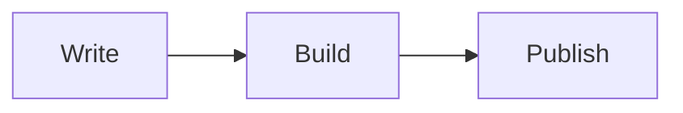

Describe a workflow with a diagram, an equation and a code example.

## Workflow

The process starts with writing and ends with publishing.



## Code

```js
const steps = ["Write", "Build", "Publish"];
console.log(steps.join(" -> "));
```

## Equation

$$a^2 + b^2 = c^2$$
